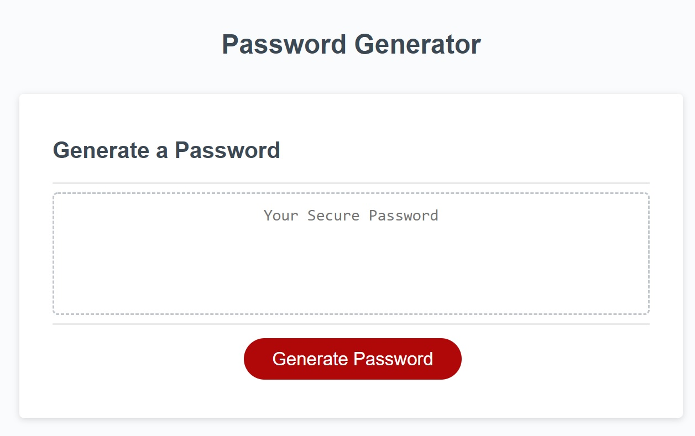
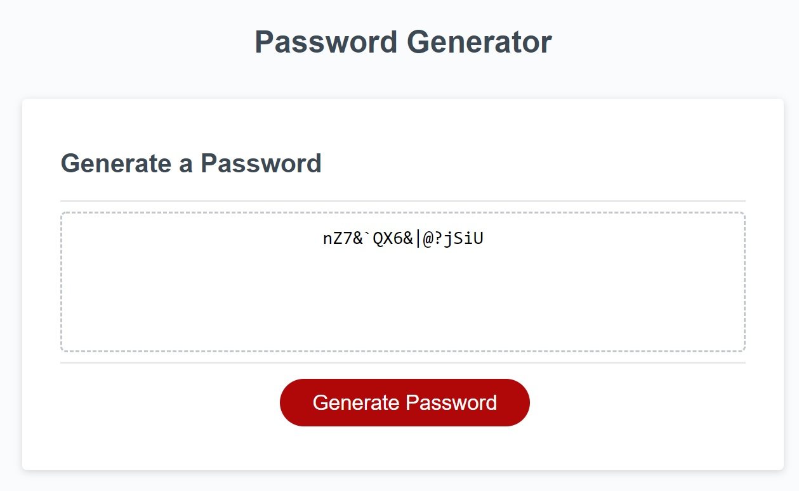

# Password Generator

## Description

The function of this website is to provide the user with a strong and secure password. The site gives the user the option to customize the password to be generated based on the criteria that best suites their use case. Options include length, and character type exclusions; such as Upper-case, Lower-case, Numerals, and Special characters. Additionally, the site includes sanity checks in the event that the user accidently inputs invalid data when prompted.

Crucially, the generated password ensures that at minimum one of every character-type the user selected is included in the generated password. 

## Installation

N/A

## Usage

Attached to this Github and [linked here](https://aesthetic-justice.github.io/Password-Generator-Site/) are portals to the site in question. Users should click the large red button labelled "Generate Password". 

Afterwards, follow the commands given by the prompts and the site will produce for you a password based on your selected criteria.

## Credits

All attached images were provided by the client and used with their permission.

## License

Please refer to the LICENSE file attached to this repo for further information.